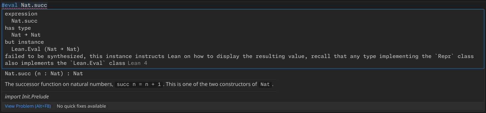
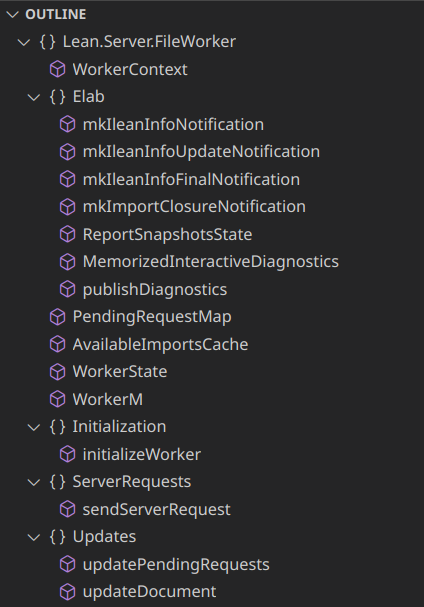
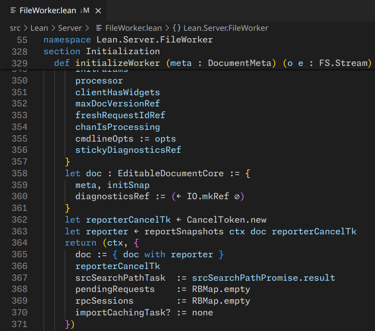

# Lean 4 VS Code 扩展手册

本手册介绍如何使用最新版本的 Lean 4 与最新版本的 VS Code 扩展进行交互。

1. [[#设置 Lean 4]]
2. [[#配置设置]]
3. [[#使用命令]]
    - [[#命令菜单]]
    - [[#命令面板]]
    - [[#按键组合]]
    - [[#配置键盘快捷键]]
4. [[#与 Lean 文件交互]]
    - [[#文件处理]]
    - [[#错误、警告和信息]]
    - [[#文件重启]]
    - [[#Unicode 输入]]
    - [[#InfoView]]
    - [[#悬停提示]]
    - [[#自动完成]]
    - [[#代码操作]]
    - [[#出现高亮]]
    - [[#语义高亮]]
    - [[#跳转到符号]]
    - [[#文档大纲]]
    - [[#面包屑]]
    - [[#可折叠代码块]]
    - [[#粘性滚动|粘性滚动]]
5. [[#导航 Lean 项目]]
    - [[#跳转到定义、声明和类型定义]]
    - [[#调用层次结构]]
    - [[#查找引用]]
    - [[#工作区符号搜索]]
    - [[#项目文本搜索]]
    - [[#跳转到文件]]
    - [[#资源管理器]]
6. [[#管理 Lean 项目]]
    - [[#创建项目]]
    - [[#打开项目]]
    - [[#项目操作]]
    - [[#终端]]
7. [[#管理 Lean 版本]]
    - [[#安装和更新 Elan]]
8. [[#故障排除]]
    - [[#设置诊断]]
    - [[#收集设置信息]]
    - [[#输出视图]]
    - [[#重启 Lean]]

---

## 设置 Lean 4

Lean 4 VS Code 扩展的 ['设置向导'](command:lean4.setup.showSetupGuide) 描述了如何设置 Lean 4。

---

## 配置设置

可以在 VS Code 的 ['设置' 页面](command:workbench.action.openSettings2) 中配置 Lean 4 VS Code 扩展和 VS Code 本身的设置。可通过导航至 '文件' > '首选项' > '设置' 或按 `Ctrl+,` (`Cmd+,`) 打开。在 '设置' 页面中，Lean 4 VS Code 扩展的设置位于 '扩展' > 'Lean 4' 下。

Lean 4 VS Code 扩展的具体设置在后续章节中有详细描述。


|  |
| :---------------------------: |
|     *VS Code '设置' 页面*     |

---

## 使用命令

Lean 4 VS Code 扩展提供了多个 VS Code 命令，可用于与 Lean 4 VS Code 扩展和 Lean 4 本身进行交互。

当尚未选择 Lean 4 文档时，只能使用不需要相关 Lean 4 文档的特定命令。这包括[创建 Lean 项目](#creating-projects)、[打开 Lean 项目](#opening-projects)、[显示故障排除信息](#troubleshooting-issues)、[管理 Lean 版本](#managing-lean-versions)以及各种文档命令，如打开本手册的命令。

一旦选择了 Lean 4 文档，就会提供额外的命令，这些命令只能在 Lean 4 文档上下文中使用。这包括[重新启动文件](#file-restarting)、[重新启动 Lean](#restarting-lean)、[切换 InfoView](#infoview)以及在给定 Lean 4 文档关联的 Lean 项目中[执行项目操作](#project-actions)。执行这些命令时，命令将在最后一个在 VS Code 中聚焦的 Lean 4 文档的上下文中运行。

Lean 4 VS Code 扩展提供的具体命令在后续章节中有详细描述。

### 命令菜单

当打开任何文本文档时，VS Code 在当前焦点文档的右上角显示一个 ∀ 符号。单击此符号将打开 Lean 4 VS Code 扩展的命令菜单。

命令菜单显示 Lean 4 VS Code 扩展提供的所有命令，并且可以在当前上下文中应用。具体来说，当尚未选择 Lean 4 文档时，它将只显示不需要相关 Lean 4 文档的命令，而一旦选择了 Lean 4 文档，它将显示所有命令。

要在尚未选择 Lean 4 文档时隐藏当前焦点文档右上角的 ∀ 符号，可以禁用 'Lean 4: Always Show Title Bar Menu' 设置。


|   |
| :---------------------------: |
| *Lean 4 VS Code 扩展命令菜单* |

### 命令面板

所有命令都可以通过 '查看' > '命令面板…' 或使用 `Ctrl+Shift+P` (`Cmd+Shift+P`) 打开的[命令面板](command:workbench.action.showCommands)中访问。输入 'Lean 4' 将显示 Lean 4 VS Code 扩展的所有命令。如果尚未选择 Lean 4 文档，则仅显示不需要相关 Lean 4 文档的命令。


|  |
| :-----------------------------: |
|       *VS Code 命令面板*        |

### 按键组合

VS Code 中的许多命令都绑定到按键组合快捷键上，需要按照顺序按下多个键才能触发命令。VS Code 中的按键组合通常为 `Ctrl+K Ctrl+<some other key>` (`Cmd+K Cmd+<some other key>`) 的形式，可以通过按住 `Ctrl` (`Cmd`)，按下 `K`，释放 `K`，然后按下 `<some other key>` 来触发。

### 配置键盘快捷键

可以通过导航至 '文件' > '首选项' > '键盘快捷键' 或使用 `Ctrl+K Ctrl+S` (`Cmd+K Cmd+S`) 的[按键组合](#chords)来配置所有命令的[键盘快捷键](command:workbench.action.openGlobalKeybindings)。输入 'Lean 4' 将显示 Lean 4 VS Code 扩展的所有命令。


|  |
| :-------------------------------: |
|     *VS Code 键盘快捷键设置*      |

---

## 与 Lean 文件交互

本节介绍如何使用 Lean 4 VS Code 扩展与、阅读和导航单个 Lean 文件进行交互。

### 文件处理

打开 Lean 文件时，需要先处理文件，以便为其提供大多数交互功能。由于 Lean 文件可能包含需要在处理文件时执行的任意自动化，因此这可能是昂贵的操作。

当前文件处理的进度显示在编辑器右侧作为滚动条的一部分的橙色条中。标有橙色条的文件区域仍在处理中，而橙色条已经消失的文件区域已完成处理。编辑器左侧显示的橙色条显示当前可见的源代码行中哪些仍在处理中。

对文件进行更改时，Lean 需要重新处理所有可能依赖于进行更改的声明的声明。目前，这意味着需要重新处理进行更改的点下方的所有代码。

对于当前仍在处理中的文件部分，Lean 无法提供任何需要文件处理信息的交互式功能。例如，在未处理的文件部分中，[错误、警告和信息](#errors-warnings-and-information)不会显示，[InfoView](#infoview) 不会显示当前的目标状态，[悬停提示](#hovers)在文件处理进度未达到相应部分之前也不会显示弹出窗口。


|                                 |
| :----------------------------------------------------------: |
| *文件处理进度。右侧的橙色条显示整个文件的进度，而左侧的橙色条显示编辑器中当前可见源代码行的进度。* |

### 错误、警告和信息

VS Code 使用在受影响代码下方显示的波浪线直接在 Lean 文件中显示三种严重性的诊断：

1. **错误**。红色波浪线表示处理文件时发生的错误。例如，语法错误使用红色波浪线表示。
2. **警告**。橙色波浪线表示该文件部分可能存在的问题。例如，未使用的变量使用橙色波浪线表示。
3. **信息**。蓝色波浪线表示该文件部分生成的附加信息。例如，`#check 0` 将在 `#check` 下方生成蓝色波浪线。

将鼠标悬停在下划线波浪线下方的代码上将在[悬停弹出面板](#hovers)中显示错误、警告或信息的内容。

将文本光标放在包含波浪线的源代码行上将在[InfoView](#infoview)的“消息”部分中显示与诊断内容的交互式版本。 "所有消息" 部分显示整个文件的所有交互式诊断内容。

为了减少视觉杂乱，对于跨多行的诊断，只有诊断的第一行会有波浪线下划线。尽管如此，只要光标位于诊断的全部跨度范围内，而不仅仅是在其第一行上，诊断就会出现在“消息”下方。

在编辑器右侧的滚动条中，红色/橙色/蓝色区域表示该文件部分包含相应严重性的诊断。

在 VS Code 底部状态栏的左侧部分显示了所有打开文件的诊断数量，使用错误、警告和信息符号进行显示。单击状态栏的此部分将打开 VS Code 的“问题视图”，显示所有当前打开文件的所有诊断，并可通过单击条目或使用箭头键和 `Enter` 快速导航到诊断的跨度。也可以使用 ['查看：显示问题'](command:workbench.actions.view.problems) 命令或 `Ctrl+Shift+M` (`Cmd+Shift+M`) 打开它。

使用 ['Error Lens'](command:extension.open?%5B%22usernamehw.errorlens%22%5D) VS Code 扩展，诊断发生的行将被突出显示，并且诊断的消息将在编辑器中内联显示。


|                                   |
| :----------------------------------------------------------: |
| *错误、警告和信息诊断及其相应的悬停和 InfoView 信息。滚动条中的红色/橙色/蓝色区域表示该区域包含相应严重性的诊断。VS Code 底部状态栏的左下方显示了所有打开文件的诊断数量，单击此部分将打开“问题视图”。* |


|  |
| :---------------------------: |
|     *VS Code '问题视图'*      |

### 文件重启

当文件 `Module.lean` 导入另一个文件 `Submodule.lean` 时，`Submodule.lean` 中的更改不会自动在 `Module.lean` 中变得可见。这是为了防止意外触发所有依赖于 `Submodule.lean` 的昂贵构建。

相反，需要使用 ['Server: Restart File'](command:lean4.restartFile) 命令手动更新 `Module.lean` 的所有依赖状态。这将触发所有更改依赖的构建。该命令可使用 `Ctrl+Shift+X` (`Cmd+Shift+X`) 调用，在 InfoView 中使用 'Restart File' 按钮，使用[命令菜单](#command-menu)，使用[命令面板](#command-palette)或在 Lean 文件的编辑器中右键单击并选择上下文菜单中的 'Server: Restart File' 条目来调用。

当编辑并保存文件的依赖关系时，VS Code 将显示[错误或信息级别的诊断](#errors-warnings-and-information)。当首次打开文件时，如果需要重新构建依赖项以使其保持最新状态，则会发出错误并拒绝[处理](#file-processing)文件的其余部分。当文件已经打开时依赖项发生更改，则会发出信息级别的诊断，但将继续处理具有先前依赖项状态的文件。

为了在打开文件时自动触发所有更改的依赖项的重建而不是发出错误，可以启用 'Lean 4: Automatically Build Dependency' 设置。


|  |
| :------------------------------------------: |
|     *InfoView 中的 'Restart File' 按钮*      |

### Unicode 输入

Lean 代码使用大量的[Unicode 符号](https://home.unicode.org/)来提高可读性。在 Lean 文件中，可以通过键入反斜杠后跟引用符号来输入这些 Unicode 符号的缩写标识符。一旦缩写标识符完成，如果该缩写标识符不是任何其他缩写标识符的前缀，那么该缩写将自动替换为相应的 Unicode 符号 - 例如，`\forall` 将产生 `∀`。

要在完成之前提前替换缩写，可以按 `Tab` 键触发 ['Lean 4: Input: Convert Current Abbreviation'](command:lean4.input.convert) 命令。这将生成与键入的标识符匹配的最短缩写标识符的 Unicode 符号。当文本光标移动到缩写外时，也会提前替换缩写。

可以使用 ['Docview: Show All Abbreviations'](command:lean4.docView.showAllAbbreviations) 命令来查看支持的所有缩写标识符和 Unicode 符号的完整列表，该命令可以在命令菜单的 'Documentation…' 子菜单中找到。在 Lean 代码中遇到 Unicode 符号时，[悬停](#hovers)在符号上会提供所有可用的缩写标识符以输入该符号。

对于一些 Unicode 括号，还有特殊的缩写标识符，它们还会插入匹配的闭合 Unicode 括号，并确保在替换缩写后光标位于 Unicode 括号之间。例如，`\<>` 生成 `⟨⟩`，`\[[]]` 生成 ``，`\f<<>>` 生成 `«»`，`\norm` 生成 `‖‖`。

Unicode 输入机制有几个配置选项：

- **'Lean 4 > Input: Custom Translations'**。允许添加额外的缩写标识符。例如，`{"foo": "☺"}` 将添加一个 `\foo` 缩写，它会生成 `☺`。条目必须以逗号分隔。
- **'Lean 4 > Input: Eager Replacement Enabled'**。取消选中此选项将禁用完整缩写的自动替换，而是要求使用 `Tab` 替换每个缩写。
- **'Lean 4 > Input: Enabled'**。取消选中此选项将禁用整个 Unicode 输入机制。
- **'Lean 4 > Input: Languages'**。允许添加 [VS Code 语言 ID](https://code.visualstudio.com/docs/languages/identifiers)，以启用该语言的 Unicode 输入机制。
- **'Lean 4 > Input: Leader'**。允许将缩写的初始字符 (`\`) 替换为其他内容。


|  |
| :--------------------------: |
|    *未完成的 `∀` 的缩写*     |


|                 |
| :---------------------------------------------------: |
| *使用 'Docview: Show All Abbreviations' 命令时的输出* |


|              |
| :-------------------------------------------: |
| *悬停 Unicode 符号以显示所有可用的缩写标识符* |

### InfoView

InfoView 是 Lean 的主要交互组件。它可用于检查证明目标、期望类型和[诊断](#errors-warnings-and-information)，以及渲染名为['widgets'](#widgets)的任意用户界面以供 Lean 代码使用。

打开 Lean 文档时，InfoView 会自动显示在文本文档旁边。可以始终使用 ['Infoview: Toggle Infoview'](command:lean4.toggleInfoview) 命令或使用 `Ctrl+Shift+Enter` (`Cmd+Shift+Enter`) 来切换它。要停止自动打开 InfoView，可以禁用 'Lean 4 > Infoview: Auto Open' 设置。

可以使用 'Lean 4 > Infoview: Style' 设置配置 InfoView 的[CSS 样式](https://github.com/leanprover/vscode-lean4/blob/master/lean4-infoview/src/infoview/index.css)。

#### 分区

InfoView 分为几个部分，其中大多数只在文本光标位于特定位置时显示：

1. **策略状态**。如果文本光标位于策略证明中，则 InfoView 将显示当前证明状态及光标位置处的所有当前打开的证明目标。每个证明目标都由名称标识，并且单击名称将折叠相应的证明目标。证明目标名称可以使用 'Lean 4 > Infoview: Show Goal Names' 设置隐藏。
2. **期望类型**。如果文本光标位于 Lean 术语中，则 InfoView 将显示光标位置处的当前期望类型。
3. **小部件部分**。小部件可能会向 InfoView 添加任意的额外部分，这些部分仅在相应小部件处于活动状态时显示。
4. **消息**。如果文本光标位于[诊断](#errors-warnings-and-information)的跨度线上，则会显示诊断的交互式变体。禁用 'Lean 4 > Infoview: All Errors On Line' 选项将仅显示位于文本光标右侧的错误。
5. **全部消息**。始终显示。包含文件中存在的所有[诊断](#errors-warnings-and-information)的交互式变体。

所有部分都可以通过使用鼠标单击它们的标题来折叠，但是期望类型和全部消息部分也可以使用 ['Infoview: Toggle Expected Type'](command:lean4.infoView.toggleExpectedType) 和 ['Infoview: Toggle "All Messages"'](command:lean4.displayList) 命令来折叠和展开。期望类型部分还可以使用 'Lean 4: Infoview > Show Expected Type' 设置来默认折叠。

使用 'Lean 4 > Infoview: Debounce Time' 设置，可以使 InfoView 在文本光标移动时更新速度更快或更慢。

禁用 'Lean 4 > Infoview: Auto Open Shows Goal' 设置将仅在自动打开 InfoView 时显示 '全部消息' 部分。


|                                  |
| :------------------------------------------------------: |
| *InfoView，包括 '策略状态'、'消息' 和 '全部消息' 部分。* |

#### 策略状态和期望类型

策略状态中的证明目标和期望类型都以 `<name> : <type>` 格式显示假设和本地可用标识符的列表。在假设列表的末尾，`⊢` 符号表示证明目标或期望类型。

不可访问的名称，即自动生成的名称，不能在 Lean 程序中使用，标记为十字符号 (`✝`) 并变灰显示。

当策略操作的结果导致证明目标发生更改时，证明状态的相应部分将以红色或绿色突出显示，具体取决于此部分的证明状态是即将被移除还是刚刚被插入。

在策略状态和期望类型部分的右上方，有三个小图标按钮：

1. **将状态复制到注释**。在当前文本光标位置插入一个包含策略状态或期望类型的注释。也可以使用 ['Infoview: Copy Contents to Comment'](command:lean4.infoView.copyToComment) 命令调用此功能。
2. **反转列表**。将证明目标 / 期望类型显示在假设列表的顶部而不是底部。可以使用 'Lean 4 > Infoview: Reverse Tactic State' 设置来翻转此设置的默认行为。
3. **筛选器**。显示一个菜单，允许从证明目标状态或期望类型中隐藏类型、实例假设、不可访问的名称和 `let` 绑定的值。

启用 'Lean 4 > Infoview: Emphasize First Goal' 设置时，辅助目标将以较小的字体大小呈现。

#### 状态栏

在 InfoView 的右上角有三个图标按钮：

1. **固定**。将当前文本光标位置的策略状态、期望类型、消息和小部件部分固定到 InfoView 的顶部，以便在查看其他代码的 InfoView 时可见。在固定的 InfoView 状态中，可以使用额外的 **显示文件位置** 图标按钮导航到固定 InfoView 状态的代码中，并且 '固定' 按钮会替换为 '取消固定' 按钮。也可以使用 ['Infoview: Toggle Pin'](command:lean4.infoView.toggleStickyPosition) 命令调用此功能。
2. **暂停更新**。冻结策略状态、期望类型、消息和小部件部分。在冻结时，'暂停更新' 按钮会替换为 '继续更新' 按钮。也可以使用 ['Infoview: Toggle Updating'](command:lean4.infoView.toggleUpdating) 命令调用此功能。
3. **更新**。重新获取所有 InfoView 数据。通常不需要使用此按钮。

#### InfoView 悬停提示

在 InfoView 中悬停在任何非本地标识符上都会打开一个悬停弹出面板，其中包含标识符的类型以及标识符的文档。这可以递归重复：在悬停弹出面板中显示的类型中悬停在标识符上，还会显示该标识符的类型和文档。

单击标识符时，其悬停弹出面板将被固定，以便在鼠标移开弹出面板时保持打开状态。当在悬停弹出面板内右键单击使用上下文菜单时，这可能特别有帮助。

可以使用 'Lean 4 > Infoview: Show Tooltip On Hover' 设置禁用 InfoView 悬停提示，但即使禁用此设置，仍然可以点击标识符打开和固定弹出面板。


|     |
| :-------------------------------: |
| *关于 `Nat` 的 InfoView 悬停提示* |

#### InfoView '跳转到定义'

在 InfoView 中右键单击任何非本地标识符并选择 '跳转到定义' 将直接跳转到代码中定义标识符的位置。按住 `Ctrl`（`Cmd`）然后单击标识符也将直接跳转到代码中定义标识符的位置。


|  |
| :---------------------------------------: |
|   *在 `Nat` 上的 InfoView '跳转到定义'*   |

#### 小部件

[用户小部件](https://lean-lang.org/lean4/doc/examples/widgets.lean.html)允许向 InfoView 添加任意的交互式组件。小部件通常注册以在特定上下文中激活，例如在调用策略时，并且在在 InfoView 中单击子表达式以选择它作为小部件输入时可能提供附加功能。

对于内置小部件的示例，在证明中调用 `simp?` 策略将在 InfoView 中显示一个 'Suggestions' 部分，其中包含一个链接，该链接执行一个[代码动作](#code-actions)。该代码动作将 `simp?` 策略调用替换为 `simp only` 策略调用，列出了简化表达式所需的所有定理。

当使用 Lean 的数学库 [Mathlib](https://github.com/leanprover-community/mathlib4) 并导入 `Mathlib.Tactic.Widget.Conv` 时，可以调用 `conv?` 策略。然后在证明目标中按住 Shift 单击子表达式将会生成 `conv` 策略调用，而不是 `conv?`，该调用专注于特定的子表达式。


|        |
| :----------------------------: |
| *`simp?` 的 '尝试这个' 小部件* |

### 悬停

当将鼠标指针悬停在代码的某个部分时，VS Code 将在弹出面板中显示该代码片段的附加信息。具体来说：

1. **标识符**。当悬停在标识符上时，VS Code 将显示标识符的类型、标识符的文档以及导入自何处的文件。
2. **错误、警告和信息**。当悬停在[下划线的代码](#errors-warnings-and-information)上时，VS Code 将显示与下划线相关联的错误、警告或信息。
3. **Unicode 符号**。当悬停在 Unicode 符号上时，VS Code 将提供所有可用的[缩写标识符](#unicode-input)以输入该符号。

还可以使用键盘使用 `Ctrl+K Ctrl+I`（`Cmd+K Cmd+I`）[按键组合](#chords)或 ['Show or Focus Hover'](command:editor.action.showHover) 命令在当前文本光标位置触发悬停。将鼠标移开悬停弹出面板将立即折叠它。单击悬停弹出面板将固定它，使其在鼠标移开悬停弹出面板时保持打开状态。


|                       |
| :----------------------------------------: |
| *固定的悬停弹出面板，显示错误和标识符信息* |

### 自动完成

自动完成是一种用于查找当前上下文中可用标识符并完成部分标识符的机制。当前上下文由当前导入集合以及可用的本地声明和变量集合确定。可以通过手动使用 `Ctrl+Space`（`Option+Esc`）或 ['Trigger Suggest'](command:editor.action.triggerSuggest) 命令随时触发自动完成。

在 Lean 4 中有三种不同类型的自动完成：

1. **点完成**。在命名空间 (`Namespace.`)、术语 (`x.` 或 `(x + 1).`)、管道运算符 (`|>.`) 或者独立的情况下 (`.`) 在输入点后，VS Code 将显示一个完整的标识符列表，这些标识符在当前上下文中可用，并且可以在点后插入。具体来说：
   - 对于命名空间，它将显示所有可用的子命名空间和存在于命名空间中的标识符（例如 `Namespace.SubNamespace` 或 `Namespace.someFunction`）。
   
   - 对于术语，它将显示与术语类型对应的命名空间中存在的所有可用标识符（例如 `x.succ` 对应于 `x : Nat`）。
   
   - 在独立的情况下，它将显示与点位置处的预期类型对应的命名空间中存在的所有可用标识符（例如，如果预期的类型是 `Nat`，则显示 `.zero`。
   
     2. **标识符完成**。当输入标识符并暂停一段时间时，VS Code 将显示所有在当前上下文中可用且与已输入的标识符部分匹配的标识符。在大多数情况下，需要至少键入标识符的第一个字符才能为标识符完成提供任何选项。
   
     3. **导入完成**。当在文件的开头触发自动完成时，其中导入由 `import` 声明表示时，VS Code 将显示所有可导入的文件。由于 Lean 的包管理器 [Lake](https://github.com/leanprover/lean4/blob/master/src/lake/README.md) 对此功能的支持仍在等待中，因此在某些 Lean 项目中，它还会显示一些位于当前 Lean 项目之外的文件，实际上不能导入。
   

在完成菜单中当前选定的标识符旁边，VS Code 显示标识符的类型和一个小插入符号。单击此插入符号或再次按下 `Ctrl+Space`（`Option+Esc`）将显示当前选定标识符的文档。

默认情况下，当按下 `Enter` 或 `Tab` 时，VS Code 将自动完成所选的标识符。由于 `Enter` 也用于将光标移动到新行，一些用户可能会觉得这种行为很烦人。可以通过将 'Accept Suggestion On Enter' 配置选项设置为 `off` 来禁用此行为。

 

|     |  |
| :-: | -------------------------- |
|     | *在 `x : Nat` 上进行点完成的完成菜单*  |

 ### 代码操作

代码操作是 Lean 建议对代码进行更改的机制。当在当前文本光标位置可用代码操作时，VS Code 将显示一个灯泡图标。单击此图标或按下 `Ctrl+.`（`Cmd+.`），然后选择其中一个条目将应用代码操作并对代码进行建议的更改。在 Lean 中，代码操作可以在用户代码中定义。

例如，内置的 `#guard_msgs` 命令可用于测试声明是否产生特定的[诊断信息](#errors-warnings-and-information)，例如 `/-- info: 2 -/ #guard_msgs (info) in #eval 1` 会产生 ```❌ Docstring on `#guard_msgs` does not match generated message: info: 1```。当将文本光标定位在 `#guard_msgs` 行时，会弹出一个灯泡，其中包含一个条目，用于将 `#guard_msgs` 上方的文档替换为实际的输出。

[Batteries](https://github.com/leanprover-community/batteries) 库还提供了一些额外有用的代码操作，例如：

- 输入 `instance : <class> := _` 将提供生成实现 `<class>` 实例的骨架的选项。
- 输入 `def f : <type1> → <type2> := _` 将提供在 `<type1>` 的值上生成匹配的选项。
- 输入 `induction x` 或 `cases x` 将提供生成 `x` 的归纳案例的选项。


|     |
| :----------------------------: |
| *`#guard_msgs` 命令的代码操作* |

### 出现高亮显示

将文本光标置于标识符上将突出显示当前文件中标识符的所有出现。为了使出现高亮显示起作用，文本光标必须从左边移入标识符，或者直接点击标识符，而不是从右边移入。

当将文本光标置于 `do` 块中的 `return` 语句上时，将突出显示 `return` 所属的 `do`。


|                       |
| :----------------------------------------------------------: |
| *参数 `x` 的出现突出显示。隐藏参数 `x` 的第二个语义上不同的 `x` 的用法不会被突出显示。* |

### 语义高亮显示

默认情况下，Lean 4 VS Code 扩展将为注释、内置关键字、定义名称、属性、`sorry`、字符串、数字和布尔值提供语法高亮显示。但是，由于 Lean 的可扩展性，VS Code 扩展不能单独为用户定义的关键字提供语法高亮显示。因此，Lean 为 Lean 文档提供了额外的所谓的语义高亮显示：

1. **关键字**。所有关键字，包括用户定义的关键字，都会被突出显示。
2. **投影**。投影表示法，例如 `value.proj` 中的 `proj`，`(value + 1).proj` 或 `value |>.proj`，会被突出显示。
3. **变量**。局部变量，例如 `def f (x : Nat) : Nat := x` 中的 `x`，会被突出显示。
4. **函数声明**。所有函数声明名称，例如 `def f : Nat := g 0 where g n := n` 中的第二个 `g`，会被突出显示。

在编辑器中这些不同类型的语法和语义高亮是否可以区分取决于在 '文件' > '首选项' > '主题' > '颜色主题' 菜单中选择的颜色主题，也可以通过使用 `Ctrl+K Ctrl+T`（`Cmd+K Cmd+T`）[组合键](#chords)或 ['首选项: 颜色主题'](command:workbench.action.selectTheme) 命令打开。


|  |
| :-----------------------------------: |
|        *证明中的语义高亮显示*         |

### 转到符号

使用 ['在编辑器中转到符号'](command:workbench.action.gotoSymbol) 命令，可以通过键入相应标识符的名称、单击或使用箭头键，在当前 Lean 文档中显示并导航到所有声明、命名空间和部分。键入 `:` 将对所有声明、所有部分和所有命名空间进行分组。


|      |
| :------------------------------: |
| *带有分组声明的 '转到符号' 面板* |

### 文档大纲

文档大纲显示了 Lean 文档的所有命名空间、部分和声明的简要概述。单击条目将跳转到代码中的相应位置。它可以通过 '查看' > '打开视图' > '大纲' 或使用 ['资源管理器: 焦点在大纲视图'](command:outline.focus) 命令打开。


|  |
| :------------------------------: |
|     *Lean 4 文档的文档大纲*      |

### 面包屑栏

将文本光标放在 Lean 文档中的任何位置时，VS Code 将在编辑器顶部和标签栏下方显示一个 '面包屑栏'，其中显示光标的完整语义位置。这包括文档的文件路径、命名空间、部分和光标所在的声明。

单击面包屑的任何条目都会显示给定级别位置的所有可用备选项列表。例如，单击命名空间中的声明将在同一文件中显示该命名空间中的所有其他声明。选择其中任何条目将直接导航到所选的代码段或文档。

面包屑栏也可以使用 `Ctrl+Shift+;`（`Cmd+Shift+;`）或 ['聚焦面包屑'](command:breadcrumbs.focus) 命令来聚焦，然后使用箭头键和 `Enter` 进行导航。


|     |
| :----------------------------: |
| *展开的命名空间内容的面包屑栏* |

### 可折叠的代码块

当将鼠标悬停在包含行号的 Lean 文档编辑器的左列上时，VS Code 会在每个命名空间、部分和声明旁边显示一个折叠符号。单击此折叠符号，使用 `Ctrl+K Ctrl+L`（`Cmd+K Cmd+L`）[组合键](#chords)或 ['切换折叠'](command:editor.toggleFold) 命令将折叠文档的这一部分。再次单击折叠符号或使用与之前相同的命令将展开代码块。

与[文档大纲](#document-outline)或[面包屑栏](#breadcrumbs)类似，可折叠的代码块可用于获取 Lean 文档的概览并快速导航，例如通过使用 ['折叠全部'](command:editor.foldAll) 命令或 `Ctrl+K Ctrl+0`（`Cmd+K Cmd+0`）[组合键](#chords)来折叠所有代码块，然后使用 ['全部展开'](command:editor.unfoldAll) 命令或 `Ctrl+K Ctrl+J` 组合键来展开所有代码块。


|        |
| :--------------------------------: |
| *带有多个折叠代码块的 Lean 4 文档* |

### 固定滚动

在浏览 Lean 文档时，编辑器顶部将显示与编辑器中显示的第一行代码相对应的周围命名空间、部分和声明的源代码行。单击其中任何一行将立即跳转到源代码中的相应行。

在 VS Code 的资源管理器和终端中也支持固定滚动。


|                     |
| :----------------------------------------------: |
| *编辑器顶部的周围命名空间、部分和声明的固定滚动* |

---

## 导航 Lean 项目

本节介绍了几个有效导航 Lean 项目的基本工具。

### 转到定义、声明和类型定义

要跳转到代码中标识符的定义位置，可以通过将文本光标置于标识符上并按 `F12`，右键单击标识符并选择 '转到定义'，或按住 `Shift` 并单击标识符来使用 ['转到定义'](command:editor.action.revealDefinition) 命令。

通过右键单击标识符并选择 '转到声明' 或将文本光标置于标识符上并按 `Alt+F12` 来使用 ['转到声明'](command:editor.action.revealDeclaration) 命令，目前在很大程度上与 '转到定义' 相同，唯一的重要区别是当 '转到定义' 跳转到标识符的展开器时，'转到声明' 将跳转到解析器。

使用通过右键单击标识符并选择 '转到类型定义' 或通过将文本光标置于标识符上并按 `F12` 来使用 ['转到类型定义'](command:editor.action.goToTypeDefinition) 命令，将跳转到光标位置的标识符的类型。


|                       |
| :----------------------------------------------------------: |
| *右键单击标识符时的上下文菜单。包含 '转到定义'、'转到声明'、'转到类型定义'、['查找所有引用'](#find-references) 和 ['显示调用层次结构'](#call-hierarchy) 条目。* |

### 调用层次结构

通过右键单击标识符并选择 '显示调用层次结构' 或将文本光标置于标识符上并按 `Alt+Shift+H`，将显示整个 Lean 项目中使用此标识符的所有声明列表。单击使用情况旁边的任何尖号之一还将递归显示该使用情况的所有使用情况。这使得可以快速了解标识符的所有使用情况所在的上下文。调用层次结构也可以使用箭头键和 `Enter` 进行导航。

单击调用层次结构视图右上角的电话图标按钮，或使用 ['显示出站调用'](command:references-view.showOutgoingCalls) 命令，将切换调用层次结构以显示在给定标识符的声明中使用的所有标识符。这对于快速获取声明依赖的不同标识符的概述很有用。

当浏览长列表的使用情况并检查每个使用情况是否对每个单独的使用情况都满足某个属性时，有时删除已经检查过的个别条目可以帮助。这可以通过将鼠标悬停在调用层次结构条目上并单击调用层次结构右侧的 X 图标按钮来完成。


|                |
| :------------------------------------------: |
| *显示标识符的所有使用情况的调用层次结构视图* |


|                       |
| :----------------------------------------------------------: |
| *显示在给定标识符的声明中使用的所有标识符的调用层次结构视图* |

### 查找引用

通过右键单击标识符并选择 '查找引用' 或将文本光标置于标识符上并按 `Shift+F12`，将显示所有 Lean 项目中使用该标识符的位置的列表。单击列表中的任何位置将直接跳转到该位置。


|           |
| :--------------------------------------: |
| *查找引用功能显示的标识符的使用位置列表* |

### 工作区符号搜索

使用 ['转到工作区中的符号…'](command:workbench.action.showAllSymbols) 命令，可以触发搜索面板，方法是使用 `Ctrl+T`（`Cmd+T`）或通过 `Ctrl+P`（`Cmd+P`）然后输入 `#` 符号。在此搜索面板中输入标识符将在当前 Lean 项目中进行模糊搜索。单击标识符或使用箭头键和 `Enter` 选择标识符将跳转到代码中声明标识符的位置。这通常比使用纯文本搜索更有效，因为它不会产生任何误报。


|  |
| :-------------------------------------: |
|            *工作区符号搜索*             |

### 项目文本搜索

使用 ['搜索：在文件中查找'](command:workbench.action.findInFiles) 命令，可以触发 `Ctrl+Shift+F`，用于在 Lean 项目中搜索文本部分。键入文本部分将显示项目中的所有匹配项，按目录和文件分组。单击任何条目将跳转到代码中的相应位置。要使用此功能，必须首先使用 ['文件：打开文件夹…'](command:workbench.action.files.openFolder) 命令将 Lean 项目文件夹在 VS Code 中打开，该命令可通过 '文件' > '打开文件夹…' 或使用 `Ctrl+K Ctrl+O`（`Cmd+K Cmd+O`）[弦](#chords)来访问。

在搜索输入聚焦时，可以使用 `向上` 和 `向下` 箭头键访问过去的搜索结果。

有几种方法可以通过搜索字段右侧的图标按钮来细化搜索：

- **匹配大小写**。将搜索结果限制为区分大小写的匹配项。例如，`word` 将不再匹配 `Word`。也可以使用 ['搜索编辑器：切换匹配大小写'](command:toggleSearchEditorCaseSensitive) 命令或 `Alt+C` 切换。
- **全词匹配**。将搜索结果限制为全词匹配项。例如，`word` 将不再匹配 `largerword`。也可以使用 ['搜索编辑器：切换全词匹配'](command:toggleSearchEditorWholeWord) 命令或 `Alt+W` 切换。
- **使用正则表达式**。使用[正则表达式](https://developer.mozilla.org/en-US/docs/Web/JavaScript/Guide/Regular_expressions)搜索文件，而不是搜索文本部分。也可以使用 ['搜索编辑器：切换使用正则表达式'](command:toggleSearchEditorRegex) 命令或 `Alt+R` 切换。

在搜索栏下方右侧，有一个带有三个点的图标按钮。单击它将打开另外两个文本输入框，允许将搜索限制为一组文件或从搜索中排除一组文件。单击 '要包含的文件' 文本输入框中的书图标按钮还将额外限制搜索仅针对打开的文件。

搜索结果还可以以更结构化的分层视图查看，方法是单击搜索视图右上角的第四个图标按钮，该按钮看起来像一堆水平线。这将显示搜索结果，就像它们出现在项目的文件结构中一样，从而更容易快速折叠不相关的搜索结果文件夹。

单击文本输入框左侧的尖号将打开 '替换' 文本字段，可以用另一个字符串替换所有搜索结果。如果已激活 '使用正则表达式' 模式，则可以使用 `$1`、`$2` 等引用正则表达式中的捕获组。

在查看了长列表的搜索结果后，有时删除已经检查过的搜索结果的单个条目可能会有所帮助。这可以通过将鼠标悬停在搜索结果上并单击搜索视图右侧的 'X' 图标按钮来完成。

通过单击搜索视图右上角包含文件图标的第三个图标按钮，或使用 ['搜索编辑器：新搜索编辑器'](command:search.action.openNewEditor) 命令，可以打开另一种搜索视图，其中搜索结果直接显示在文本编辑器中。单击文本编辑器将导航到代码中的相应位置。


|                               |
| *启用分层树显示选项的搜索视图* |

### 转到文件

使用 ['转到文件'](command:workbench.action.quickOpen) 命令，按下 `Ctrl+P`（`Cmd+P`）将显示一个搜索提示框，允许键入文件名以进行打开和聚焦。它可用于使用键盘快速导航文件。

要使用此功能，必须首先使用 ['文件：打开文件夹…'](command:workbench.action.files.openFolder) 命令将 Lean 项目文件夹在 VS Code 中打开，该命令可通过 '文件' > '打开文件夹…' 或使用 `Ctrl+K Ctrl+O`（`Cmd+K Cmd+O`）[弦](#chords)来访问。

|                                    |
|:-:|
| *带有搜索包含 'K' 的文件名的 '转到文件' 面板* |

### 文件资源管理器

VS Code具有内置的文件资源管理器，可以使用 ['View: Show Explorer'](command:workbench.view.explorer) 命令或 `Ctrl+Shift+E`（`Cmd+Shift+E`）来打开它。可以使用鼠标、箭头键和 `Enter` 进行导航，或者通过键入文件或文件夹名称来跳转到相应位置。使用右键单击打开的上下文菜单，内置文件资源管理器还支持几个基本的文件操作，如使用它们的标准键盘快捷键创建、删除、复制或重命名文件。

默认情况下，VS Code始终会将焦点放在当前正在关注的编辑器所在的资源管理器文件上。这意味着随着时间的推移，VS Code会不断展开文件夹。为了重新获得文件树的自上而下的层次透视，并折叠所有文件夹，可以按资源管理器视图右上角的第四个图标按钮，调用 ['折叠资源管理器中的文件夹'](command:workbench.files.action.collapseExplorerFolders) 命令。

通过按住 `Ctrl`（`Cmd`）并单击两个文件，右键单击其中任何文件时会出现一个 'Compare Selected' 条目。这将打开一个差异视图，显示两个文件之间的更改。


|  |
| :---------------------------: |
|   *VS Code 文件资源管理器*    |

---

## 管理 Lean 项目

本节描述了如何使用 Lean 4 VS Code 扩展管理 Lean 项目。所有这些命令都提供了 Lean 的包管理器 [Lake](https://github.com/leanprover/lean4/blob/master/src/lake/README.md) 的前端。

### 创建项目

有两个项目创建命令可以通过 [命令面板](#command-palette) 或通过导航到 [命令菜单](#command-menu) 中的 'New Project…' 子菜单来访问：

1. **['Project: Create Standalone Project…'](command:lean4.project.createStandaloneProject)**。此命令将在文件夹创建对话框中指定的名称下创建一个新的 Lean 4 项目，不带任何额外的依赖项。它将使用项目的 Lean 版本的 `leanprover/lean4:stable` 工具链，初始化一个 [Git](https://git-scm.com/) 存储库，并使用所有新项目中的所有文件创建一个初始提交。
1. **['Project: Create Project Using Mathlib…'](command:lean4.project.createMathlibProject)**。此命令将在文件夹创建对话框中指定的名称下创建一个新的 Lean 4 项目，该项目依赖于 Lean 的数学库 [Mathlib](https://github.com/leanprover-community/mathlib4)。它将使用 Mathlib 的 Lean 工具链作为项目的 Lean 版本，下载并安装当前的 Mathlib 构建工件缓存，初始化一个 [Git](https://git-scm.com/) 存储库，并使用所有新项目中的所有文件创建一个初始提交。

### 打开项目

有两个打开现有 Lean 项目的命令，可以通过 [命令面板](#command-palette) 或通过导航到 [命令菜单](#command-menu) 中的 'Open Project…' 子菜单来访问：

1. **['Project: Open Local Project…'](command:lean4.project.open)**。此命令将打开由文件夹选择对话框中指定的文件夹中的 Lean 4 项目。此命令与 VS Code 自带的 'Open Folder…' 命令基本相同，但还会立即确保打开的文件夹实际上是一个 Lean 4 项目。
1. **['Project: Download Project…'](command:lean4.project.clone)**。此命令将 Lean 4 项目从给定的 URL 下载到文件夹创建对话框中指定的文件夹中。如果下载的项目是 Lean 的数学库 [Mathlib](https://github.com/leanprover-community/mathlib4) 或依赖于它，它还将下载并安装当前的 Mathlib 构建工件缓存。

### 项目操作

Lean 4 VS Code 扩展支持以下可以在现有 Lean 项目中运行的命令，并且可以通过 [命令面板](#command-palette) 或通过导航到 [命令菜单](#command-menu) 中的 'Project Actions…' 子菜单来访问：

1. **['Project: Build Project'](command:lean4.project.build)**。构建完整的 Lean 项目。如果项目是 Lean 的数学库 [Mathlib](https://github.com/leanprover-community/mathlib4) 或依赖于它，它还将在尝试构建项目之前下载并安装当前的 Mathlib 构建工件缓存。
2. **['Project: Clean Project'](command:lean4.project.clean)**。删除 Lean 项目的所有构建产物。如果项目是 Lean 的数学库 [Mathlib](https://github.com/leanprover-community/mathlib4) 或依赖于它，它将在清理项目后提供下载并安装当前的 Mathlib 构建工件缓存。
3. **['Project: Update Dependency…'](command:lean4.project.updateDependency)**。显示可以更新的所有依赖项列表。选择依赖项并更新后，如果项目是 Lean 的数学库 [Mathlib](https://github.com/leanprover-community/mathlib4) 或依赖于它，它还将下载并安装当前的 Mathlib 构建工件缓存。最后，如果更新的项目的 Lean 工具链与项目的 Lean 工具链不同，命令将提供将项目的 Lean 工具链更新为更新的依赖项的 Lean 工具链。
4. **['Project: Fetch Mathlib Build Cache'](command:lean4.project.fetchCache)**。如果项目是 Lean 的数学库 [Mathlib](https
5. ://github.com/leanprover-community/mathlib4) 或依赖于它，此命令将下载并安装当前的 Mathlib 构建工件缓存。

   

   |           |
   | :----------------------------------------: |
   | *'Project: Update Dependency…' 选择对话框* |

   ### 终端

   如果 Lean 项目的管理需要的命令不足够，可以通过调用 ['Terminal: Create New Terminal'](command:workbench.action.terminal.new) 命令，或按 `Ctrl+Shift+``（`Cmd+Shift+``） 来启动内置的 VS Code 终端。在此终端中，可以执行所有 [Lake](https://github.com/leanprover/lean4/blob/master/src/lake/README.md) 命令。

   

   |  |
   | :---------------------------: |
   |      *VS Code 终端视图*       |

   ---

   ## 管理 Lean 版本

   本节介绍如何管理不同的 Lean 版本。所有这些命令都提供了 Lean 的版本管理器 [Elan](https://github.com/leanprover/elan/blob/master/README.md) 的前端。目前，VS Code 扩展还不支持许多 Elan 命令。

   ### 安装和更新 Elan

   Lean 的版本管理器 [Elan](https://github.com/leanprover/elan/blob/master/README.md) 可以通过使用 ['Setup: Install Elan'](command:lean4.setup.installElan) 命令来安装或更新。该命令可以在 [命令面板](#command-palette) 中找到，也可以通过导航到 [命令菜单](#command-menu) 中的 'Version Management…' 子菜单找到。

   ---

   ## 故障排除

   本节涵盖了几种工具，可以帮助诊断 Lean 设置、Lean 4 VS Code 扩展和 Lean 本身的问题。

### 设置诊断

Lean 4 VS Code 扩展在启动 Lean 之前会检查用户的 Lean 设置是否良好。有两种不同类型的设置诊断：全局级别和项目级别。

- 全局级别的诊断在打开第一个 Lean 文件时进行检查。如果存在错误级别的设置问题，则不会激活任何与 Lean 相关的 Lean 4 VS Code 扩展功能。以下是检查用户设置的全局级别方面：
  1. 是否安装了 [Curl](https://curl.se/) 和 [Git](https://git-scm.com/)（错误）
  2. 是否可以找到某个版本的 Lean（错误）
  3. Lean 的版本管理器 [Elan](https://github.com/leanprover/elan/blob/master/README.md) 是否已安装并且合理地保持最新状态（警告）
- 项目级别的诊断在打开项目的第一个 Lean 文件时进行检查。如果存在错误级别的设置问题，Lean 将不会为该项目启动，但是只要全局级别的诊断没有产生错误，所有其他与 Lean 相关的扩展功能都将处于活动状态。以下是检查用户设置的项目级别方面：
  1. 是否在尚未保存到文件系统的无标题文件中运行 Lean（警告）
  2. 与文件相关联的项目中是否可以找到 lean-toolchain 文件（警告）
  3. 是否可以找到某个版本的 Lean（错误）
  4. 与文件相关联的项目是否是 Lean 3 项目（错误）
  5. 与文件相关联的项目是否使用 Lean 4 第一个稳定版本之前的 Lean 版本（警告）
  6. 是否可以找到某个版本的 Lean 的包管理器 [Lake](https://github.com/leanprover/lean4/blob/master/src/lake/README.md)（错误）

如果存在全局级别的设置诊断错误，则重新打开 Lean 文件将使 Lean 4 VS Code 扩展再次检查设置。对于项目级别的设置诊断错误，切换到另一个文件选项卡然后再切换回来即可重新检查设置。

所有设置警告都可以通过 'Lean 4: Show Setup Warnings' 设置进行禁用。

### 收集设置信息

通过执行 ['Troubleshooting: Show Setup Information'](command:lean4.troubleshooting.showSetupInformation) 命令，可以在上次聚焦的 Lean 4 文件的上下文中收集有关用户设置的信息并显示出来。它包括以下信息：

1. 操作系统
2. CPU 架构
3. CPU 型号
4. 可用的总 RAM
5. 是否安装了 [Curl](https://curl.se/)
6. 是否安装了 [Git](https://git-scm.com/)
7. Lean 的版本管理器 [Elan](https://github.com/leanprover/elan/blob/master/README.md) 是否已安装并且合理地保持最新状态，以及 Elan 的版本
8. 是否安装了 Lean 并且保持合理地最新状态，以及 Lean 的版本
9. 是否打开了带有 lean-toolchain 的 Lean 项目，以及项目的路径
10. 可用的 Elan 工具链

输出使用 Markdown 格式化，复制到支持 Markdown 的工具，例如 [Lean Zulip](https://leanprover.zulipchat.com)，将产生一个良好渲染的输出。

<br/>

|  |
| :-------------------------------: |
|          *设置信息输出*           |

### 输出视图

当 Lean 在与文件交互时产生错误，或者执行外部命令时产生错误时，这些错误以及所有外部命令输出都会显示在 'Lean: Editor' 输出视图中，这有助于诊断问题。可以使用 ['Troubleshooting: Show Output'](command:lean4.troubleshooting.showOutput) 命令从 [命令面板](#command-palette) 或 [命令菜单](#command-menu) 打开该视图。

<br/>

|  |
| :-------------------------: |
|  *'Lean: Editor' 输出视图*  |

### 重启 Lean

当与 Lean 交互时出现问题，并且似乎与 Lean 的交互严重受损，例如 Lean 中发生了错误，可以始终使用 ['Server: Restart Server'](command:lean4.restartServer) 命令从 [命令面板](#command-palette) 或 [命令菜单](#command-menu) 来完全重新启动它。如果 Lean 4 VS Code 扩展出现了错误，则重新启动 VS Code 可能有所帮助。